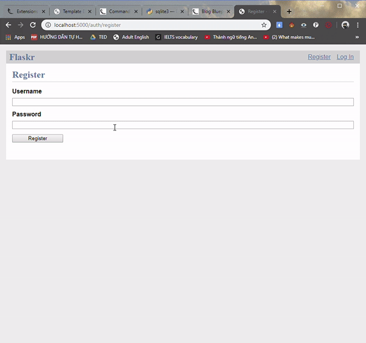

**Flask Tutorial Application**
---------------
This is a simple application base on the tutorial on Flask documentation.
The functionality include:
+ Register / Login User
+ Save user info, blog posts in SQLite database.
+ Blog post
    - Create new post
    - Update if you're the post author
    - Delete post
--------------
Short demo:  

